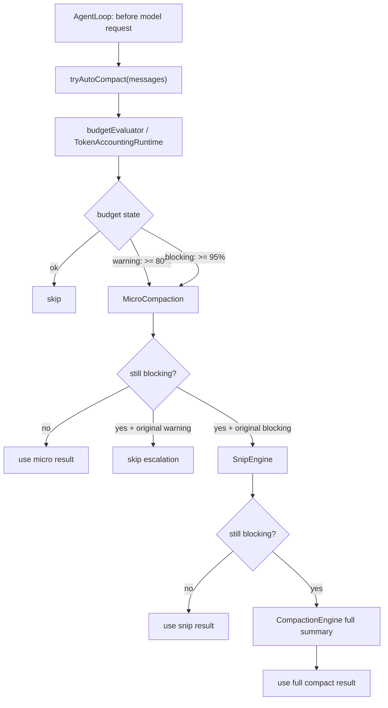

# PilotDeck 自动压缩机制

本文档描述 `feat/better-comp-0618` 当前的上下文自动压缩机制。它覆盖 AgentLoop 中的主动压缩、token accounting、micro/snip/full 三层压缩、routing 后二次预算检查，以及相关的失败兜底和不变量。

相关源码：

- `src/agent/loop/AgentLoop.ts`
- `src/context/DefaultContextRuntime.ts`
- `src/context/budget/TokenAccountingRuntime.ts`
- `src/context/budget/TokenBudgetManager.ts`
- `src/context/compaction/AutoCompactionPolicy.ts`
- `src/context/compaction/MicroCompactionEngine.ts`
- `src/context/compaction/SnipEngine.ts`
- `src/context/compaction/CompactionEngine.ts`
- `src/context/compaction/CachedMicroCompactionEngine.ts`
- `src/router/RouterRuntime.ts`
- `src/cli/createLocalGateway.ts`

## 1. 总览

当前自动压缩是一个“先便宜、后昂贵”的主动上下文预算控制流程：

1. 每次模型调用前，`AgentLoop` 先让 `ContextRuntime.tryAutoCompact()` 评估当前 messages 是否接近上下文窗口。
2. 预算评估优先走统一的 `TokenAccountingRuntime`，它会优先尝试 provider 官方 token count API，失败时回退本地估算。
3. 当预算进入 warning 区间时，只做 cheap micro compaction。
4. 当预算进入 blocking 区间时，先做 micro；如果仍超预算，再尝试 snip；最后才使用 full summary compaction。
5. router 选出具体 provider/model 后，如果 routed model 的 context window 比默认 agent model 更小，会再跑一次 post-routing compaction。

核心目标是：

- 降低 full summary 的调用频率。
- 在 80% 附近先用低风险、低成本方式减少旧工具结果。
- 在 95% 附近才进入更激进的 snip/full。
- 预算计算包含预留输出空间，避免 prompt 塞满 context window 后模型没有足够输出余量。
- 保持 `tool_call` / `tool_result` 配对完整，避免 provider 拒绝请求。



## 2. 入口位置

主动压缩入口在 `AgentLoop.run()` 的每轮内部循环开头，发生在 `createModelRequest()` 之前。

流程如下：

1. 检查 `abortSignal`。
2. 如果 context runtime 支持 `tryAutoCompact`，调用自动压缩。
3. 若返回 `type: "compacted"`，将 loop 内的 `messages` 替换为压缩后的 messages，并发出 `turn_continued`，reason 为 `auto_compact`。
4. 不管是否压缩，都会发出 `context_budget` 事件，携带当前预算 snapshot。
5. 自动压缩期间的异常会被吞掉，避免压缩失败阻断正常模型调用。

这个设计意味着自动压缩是 best-effort：它应该帮助请求更可能进入模型窗口，但不能成为模型调用的新故障点。

## 3. 预算模型

### 3.1 输入预算

自动压缩评估的不是完整 context window，而是预留输出后的 prompt budget：

```text
promptBudget = maxContextTokens - reservedOutputTokens
```

其中：

- `maxContextTokens` 来自 agent 配置或 routed model capability。
- `reservedOutputTokens` 由 `AgentLoop.getReservedOutputTokens()` 提供。
- 默认预留为 `config.maxOutputTokens ?? 4096`。
- `promptBudget` 最低会被限制为 `1`，避免除零或负预算。

预算 snapshot 中的 `maxContextTokens` 字段表示这个有效 prompt budget，而不是原始模型窗口。

### 3.2 阈值

`AutoCompactionPolicy` 使用两档阈值：

| 状态 | ratio | 行为 |
| --- | --- | --- |
| `ok` | `< 0.8` | 不触发自动压缩 |
| `warning` | `>= 0.8` 且 `< 0.95` | 只触发 micro compaction |
| `blocking` | `>= 0.95` | micro 不够时升级到 snip/full |

`ratio` 的计算方式：

```text
ratio = inputTokens / promptBudget
```

### 3.3 本地估算

本地估算由 `TokenBudgetManager` 提供：

- 文本、代码、JSON、tool argument 使用 `js-tiktoken` 的 `o200k_base`。
- 每条 message 有默认 `4` token 的 wrapper overhead。
- image/pdf/audio 使用固定占位，默认 `2000` tokens。
- `tool_call` 按工具名和参数 JSON 估算。
- `tool_result` 会把可见文本展平后估算。
- 自动压缩 gate 默认使用 padding 估算。

padding 规则：

```text
paddedTokens = ceil(rawTokens * 4 / 3)
```

这用于抵消本地 tokenizer 和 provider 真实计数之间的偏差，尤其是工具结构、图片、PDF、provider wrapper 等部分。

## 4. TokenAccountingRuntime

`TokenAccountingRuntime` 是当前 token accounting 的统一入口。它被注入到 agent dependencies、router 和 compaction engine 中。

主要接口：

- `countRequestInput(request, opts)`
- `evaluateRequestBudget(request, opts)`
- `estimateMessages(messages, opts)`
- `estimateResponseEvents(events, opts)`
- `estimateRequestInput(request, opts)`

### 4.1 provider 官方计数优先

当 `useProviderCount !== false` 时，`countRequestInput()` 会先尝试 provider 官方 token count。

OpenAI 官方 provider：

- 仅当 provider protocol 为 `openai`，且 base URL 是 `https://api.openai.com` 或 `https://api.openai.com/v1` 时启用。
- 调用 endpoint：`/v1/responses/input_tokens`。
- 拼 endpoint 时使用 origin base，避免出现 `/v1/v1/responses/input_tokens`。
- 会把 canonical request 转成 Responses API 的 `input`、`tools`、`tool_choice`、`text.format` 形态。
- OpenAI-compatible 但非官方 URL 不走官方 count，直接回退本地估算。

Anthropic provider：

- 当 provider protocol 为 `anthropic` 时启用。
- 调用 endpoint：`/v1/messages/count_tokens`。
- 复用 Anthropic request lowering 后的 body，并保留 `model`、`messages`、`system`、`tools`、`tool_choice`、`thinking`。

### 4.2 失败回退

provider count 是 best-effort：

- 默认超时 `1500ms`。
- HTTP 非 2xx、网络错误、超时、返回体缺 token 字段都会回退本地估算。
- 回退结果不会让 turn 失败。
- snapshot 会标记：
  - `source: "local"`
  - `exact: false`
  - `estimatorError`，记录 provider count 失败原因。

provider 成功时：

- `source: "provider"`
- `exact: true`

### 4.3 请求级缓存

`TokenAccountingRuntime` 内部有 in-memory cache，默认大小 `256`。

cache key 基于 request 的稳定 JSON hash，包含：

- provider
- model
- messages
- systemPrompt
- tools
- toolChoice
- thinking
- outputSchema
- cacheBreakpoints

只有 provider count 成功结果会进 cache。这样同一轮中 initial、post-micro、post-snip 等多次评估不会重复请求官方 count API。

## 5. 自动压缩分层

`DefaultContextRuntime.tryAutoCompact()` 是自动压缩的核心调度器。

它先拿到 initial snapshot，再交给 `AutoCompactionPolicy.evaluateSnapshot()`。如果 state 是 `ok`，直接跳过；如果 state 是 `warning` 或 `blocking`，进入分层压缩。

### 5.0 保护型上下文

自动压缩现在有一组内部默认保护名单，用来避免关键信息被普通压缩策略误删或过度截断。

默认保护工具名包括：

- `read_skill` / `ReadSkill`
- `ask_user_question` / `AskUserQuestion`
- `todo_write` / `TodoWrite`
- `structured_output` / `StructuredOutput`
- `agent` / `Agent` / `Task`
- `task_create` / `TaskCreate`
- `task_list` / `TaskList`
- `task_output` / `TaskOutput`
- `task_stop` / `TaskStop`

保护判断基于 assistant `tool_call.id -> toolName` 映射，再识别后续 `tool_result` 或 `tool_result_reference`。因此，即使结果 block 本身只有 `toolCallId`，也能知道它属于哪个工具。

另外，显式 `<memory-context>` 文本消息也会被识别为保护型上下文。注意当前 memory 主要在 `prepareForModel()` 时注入 system prompt，不是普通 tool result；这里只保护已经出现在 messages 里的 `<memory-context>` 消息。

v1 不开放配置 schema；保护名单通过内部常量和 engine options 注入。`read_file`、`grep`、`glob`、`web_search`、`web_fetch` 默认不保护，因为这些结果通常可重取且容易很大。

### 5.1 Tier 1: MicroCompactionEngine

micro compaction 是第一层，也是 warning 区间唯一允许执行的压缩。

它不会调用模型，也不会生成摘要，只重写旧的 `tool_result` 内容：

- 保护名单内的工具结果完整保留，不参与 preview 截断。
- 保护名单内的工具错误不参与重复错误折叠。
- 默认每类工具保留最近 `2` 条完整结果。
- 旧的大型 `tool_result` 超过默认 `12_000` chars 时，替换为 head/tail preview。
- preview 会带上固定前缀：

```text
[Old tool result content compacted]
```

- 中间省略部分会标记：

```text
... [N chars omitted by auto micro-compaction] ...
```

重复工具错误折叠规则：

- 连续相同工具、相同错误文本，并且错误属于可折叠类型时，run 长度超过 `2` 才折叠。
- 首尾错误保留完整。
- 中间错误替换为：

```text
[Repeated tool failures compacted]
```

可折叠错误文本目前包括：

- `invalid_tool_input`
- `tool_execution_failed`
- `Tool execution failed`
- `Tool input validation failed`

重要不变量：

- micro 只替换 `tool_result.content`。
- 保留原 `toolCallId`。
- 不删除对应的 assistant `tool_call`。
- 因此不会制造 orphan `tool_result` 或 dangling `tool_call`。

micro 后会重新评估预算：

- 如果新 snapshot 不是 `blocking`，返回 `type: "compacted"`，tier 为 `micro`。
- 如果仍是 `blocking`，是否升级取决于最初触发原因。

### 5.2 warning 区间不会升级

如果 initial snapshot 是 `warning_threshold`，即使 micro 后仍然 warning，也不会继续 snip/full。

当前逻辑只有当 micro 后仍是 `blocking` 且最初就是 `blocking_threshold`，才允许进入下一层。

这保证 80% 到 95% 的区间不会触发 summary 模型调用。

### 5.3 Tier 2: SnipEngine

snip 是 blocking 区间的第二层。

它按 turn 进行中间裁剪：

- 默认保留前 `2` 个 turns。
- 默认保留后 `4` 个 turns。
- 中间 protected turns 会被原文保留。
- 其他中间 turns 被删除。
- 每个被删除的连续 gap 会插入一个 user role 的 boundary marker：

```xml
<snip-boundary turnsSnipped="..." headTurns="2" tailTurns="4" />
```

turn 的划分规则：

- 一个普通 user message 开始一个 turn。
- 随后的 assistant message 和纯 tool_result user messages 属于同一个 turn。
- 纯 tool_result user message 不会单独开始新 turn。

tool pair 处理：

- snip 先生成 head + protected middle + tail 的投影视图。
- 如果投影视图中有未配对 `tool_call`，会移除这个 `tool_call`。
- 如果投影视图中有未配对 `tool_result` / `tool_result_reference`，会移除这个结果 block。
- 输出会经过 `ensureTrailingUserMessage()`，确保 provider 看到的消息尾部合法。

snip 后会重新评估预算：

- 如果不再 `blocking`，返回 tier `snip`。
- 如果仍然 `blocking`，进入 full compaction。

### 5.4 Tier 3: CompactionEngine full summary

full compaction 是最后一层，只有 blocking 且 micro/snip 不够时才走。

它会发起一次 summarizer 模型调用：

- trigger 为 `auto`。
- 默认 summary system prompt 来自 `COMPACT_SYSTEM_PROMPT_DEFAULT`。
- summary call 默认 `maxOutputTokens` 为 `20_000`。
- summary 输入会先通过 `stripMultimediaFromMessages()` 去除多媒体内容。
- summarized prefix 中的 protected turns 不进入 summarizer 输入，而是原文保留在 compact 后上下文中。
- trailing prompt 要求 summary 输出结构化 Markdown handoff，优先使用固定二级标题，并保留原任务、当前状态、完成/剩余步骤、关键路径/URL/数据、工具发现、错误和恢复方式、开放问题。

推荐 Markdown sections：

```markdown
## Objective
## Current State
## Completed
## Remaining
## Decisions
## Files And Artifacts
## Tool Findings
## Errors And Recovery
## Open Questions
```

这是软约束，不是 JSON/XML schema。空 section 建议写 `None`。如果 caller 传入 `userInstruction`，它会作为 `Additional summary instructions` 追加到默认 Markdown handoff 约束后面，不会替换默认结构要求。

full compaction 的输出结构由 `buildPostCompactMessages(result)` 组装，顺序是：

1. compact boundary marker。
2. summary message，如果 summary 成功。
3. messagesToKeep，即 protected prefix turns 加上按 tail ratio 保留的原始消息。
4. attachments。
5. hookResults。

boundary marker 示例：

```xml
<compact-boundary trigger="auto" preTokens="..." messagesSummarized="..." status="ok" />
```

默认 `keepTailRatio` 为 `0.35`，也就是保留末尾约 35% 的消息。保留 tail 前会清理跨边界未配对的 tool call/result。

metadata：

- `preTokens` 使用 `TokenAccountingRuntime.estimateMessages()`，没有 runtime 时回退 `TokenBudgetManager`。
- summary 成功时计算 `postTokens`。
- summary 成功但缺少核心 Markdown 标题（`Objective`、`Current State`、`Remaining`、`Files And Artifacts`）时，会添加 `compact_summary_structure_weak` warning diagnostic；v1 不重试、不拒绝 summary。
- lifecycle 会发出 `PreCompact` 和 `PostCompact`。
- event emitter 会发出 `compact_started` 和 `compact_completed`。

如果 summary 模型调用失败，`CompactionEngine.run()` 会返回带 error diagnostic 的 result，而不是直接抛出。当前 `DefaultContextRuntime` 仍会把 `buildPostCompactMessages(result)` 作为 full compact 结果返回；这种情况下 boundary status 为 `summary_failed`，且没有 summary message。

## 6. AgentLoop 中的两次预算检查

### 6.1 pre-routing 检查

第一次检查发生在模型请求创建前，使用 agent 默认配置中的 `maxContextTokens`。

`AgentLoop` 会构造一个 async `budgetEvaluator(messages)`：

1. 使用候选 messages 调 `createModelRequest()`。
2. `createModelRequest()` 会走完整 context prepare，包括 instructions、tools、cache breakpoints 等。
3. 为了预算评估不重复发事件，会传 `emitInstructionEvents: false`。
4. 调 `TokenAccountingRuntime.evaluateRequestBudget()` 得到 snapshot。

这比只估算 raw messages 更接近真实 provider 请求，因为它包含 system prompt、tool schemas、prepared messages 等内容。

### 6.2 post-routing 检查

第一次 `router.decide()` 后，`AgentLoop` 会检查 routed model 的 context window：

```text
if routedMaxContextTokens < agentMaxContextTokens:
  run tryAutoCompact again with routedMaxContextTokens
```

post-routing 的 budget evaluator 会把 candidate messages materialize 成 routed request：

1. 先用 candidate messages 重新 `createModelRequest()`。
2. 把 candidate request 的 messages、system prompt、tools、cache breakpoints 合并到 base request。
3. 调 `router.materializeRequest(decision, request)` 应用 routed provider/model/requestPatch/orchestration。
4. 用 routed request 做 token budget 评估。

如果 post-routing compact 成功，`AgentLoop` 会：

1. 更新 loop 内的 `messages`。
2. 重新 `createModelRequest(messages)`。
3. 重新 `router.decide()`。

重新 decide 的原因是避免旧的 `decision.requestPatch.messages` 覆盖压缩后的 messages，同时确保 provider、model、requestPatch、orchestration 都与新上下文一致。

## 7. 与 router usage 的关系

`RouterRuntime` 也复用 `TokenAccountingRuntime`，但用途不同：

- subagent max-token guard 使用 `estimateRequestInput(attemptRequest)` 判断是否超过 `autoOrchestrate.subagentMaxTokens`。
- provider 没返回 usage 或返回空 usage 时，用统一 estimator 生成 fallback usage：
  - input 使用 `estimateRequestInput(attemptRequest)`。
  - output 使用 `estimateResponseEvents(bufferedEvents)`。

这些路径不触发自动压缩，只保证 token 统计和 guard 使用同一套估算逻辑。

## 8. CachedMicroCompactionEngine

`CachedMicroCompactionEngine` 名字里也有 microcompaction，但它和 `MicroCompactionEngine` 是两件事。

`CachedMicroCompactionEngine` 用于 Anthropic prompt cache breakpoint：

- 它不重写 messages。
- 它只计算哪些消息位置应加 `cache_control: ephemeral`。
- 默认 live threshold 为 `4`。
- 只考虑 `COMPACTABLE_TOOL_NAMES` 中的工具。
- 子 agent 不运行这条路径。
- 可通过 provider usage 中的 `cacheReadTokens` 判断 cache hit。

这是一种请求准备阶段的缓存优化，不是自动压缩 tier，不会减少 durable transcript，也不会替换旧 tool result 内容。

## 9. 与 durable transcript 的关系

当前自动压缩主要作用于 AgentLoop 当前用于下一次模型调用的 `messages` 视图。

重要边界：

- micro/snip/full 都会返回一组新的 messages 给 loop。
- loop 后续用这组 messages 构建模型请求。
- 已经写入 durable transcript 的原始消息不会因为 micro 直接被就地修改。
- 工具执行结果进入 durable transcript 的路径仍由 `onDurableMessage` / session storage 负责。
- 大型工具结果落盘仍由 `ToolResultBudget` 在 `applyToolResults()` 阶段处理，和自动压缩是不同机制。

因此，自动压缩可以改变后续模型看到的上下文视图，但不应悄悄破坏历史持久化记录。

## 10. 失败与兜底

当前机制有几层兜底：

- provider token count 失败：回退本地 padded estimate。
- 自动压缩抛错：`AgentLoop` 吞掉异常，继续用原 messages 调模型。
- full summary 失败：`CompactionEngine` 返回 diagnostic 和 boundary，调用方仍能继续。
- 模型实际返回 `prompt_too_long`：走 reactive recovery，由 `ContextOverflowRecovery` 决定截断头部或其他恢复策略。
- multimodal processor 错误：可走 strip images retry。

主动压缩和 reactive recovery 是两条路径：

- 主动压缩发生在模型调用前，目标是预防超窗。
- reactive recovery 发生在 provider 已经报错后，目标是尽量恢复当前 turn。

## 11. 关键不变量

自动压缩相关测试主要保护这些不变量：

- warning 区间只触发 micro，不触发 full summary。
- blocking 区间先 micro，micro 不够才 snip/full。
- 旧大型 tool result 会被 preview 替换。
- 每类工具最近 `2` 条结果保持完整。
- 连续重复工具错误只折叠中间，首尾保留。
- 压缩后不能出现 orphan `tool_result` 或 dangling `tool_call`。
- post-routing compact 使用 routed model 的 context window 和 reserved output budget。
- post-routing compact 成功后会重新 decide，避免旧 request patch 覆盖新 messages。
- OpenAI 官方 `/v1` base URL 不会拼出 `/v1/v1/...`。
- OpenAI-compatible 非官方 URL 不走 OpenAI 官方 count endpoint。

## 12. 当前限制

当前版本仍有一些刻意保留的限制：

- 没有新增配置 schema；阈值和行为主要由现有 runtime wiring 决定。
- provider count 只用于 input/prompt budget，不改变 output token recovery 策略。
- 本地 fallback 仍是 `o200k_base` + `4/3` padding，没有持久化校准。
- full summary prompt 和 post-compact 消息顺序保持现状。
- `read_file` 的直接文本 token 限制没有并入本轮自动压缩预算。
- 没有引入复杂 anchor 系统、tool_search 专用策略或子 agent 编排压缩策略。

## 13. 快速定位

常见问题对应的源码入口：

| 问题 | 入口 |
| --- | --- |
| 为什么 80% 没有 full summary | `DefaultContextRuntime.tryAutoCompact()` 中 `decision.reason === "warning_threshold"` 分支 |
| 为什么预算比 messages token 大 | `TokenAccountingRuntime.estimateRequestInput()` 计入 system prompt 和 tool schemas |
| 为什么 token snapshot 的 maxContextTokens 变小 | `TokenBudgetManager.snapshotFromTokens()` 扣除了 `reservedOutputTokens` |
| 为什么 OpenAI count 没被调用 | `isOfficialOpenAIProvider()` 只允许官方 `api.openai.com` |
| 为什么 post-routing 后又 decide 一次 | `AgentLoop` 在 recompact 成功后重建 request 并重新 `router.decide()` |
| 为什么旧 tool_result 变成 preview | `MicroCompactionEngine.apply()` 超过 `trimToBytes` 且不在最近保留集合 |
| 为什么 snip 后 tool call 消失 | `SnipEngine` 为保持 pair integrity 移除了跨边界未配对 block |
| 为什么 prompt cache breakpoint 不减少 token | `CachedMicroCompactionEngine` 只加 cache hint，不改 messages |
